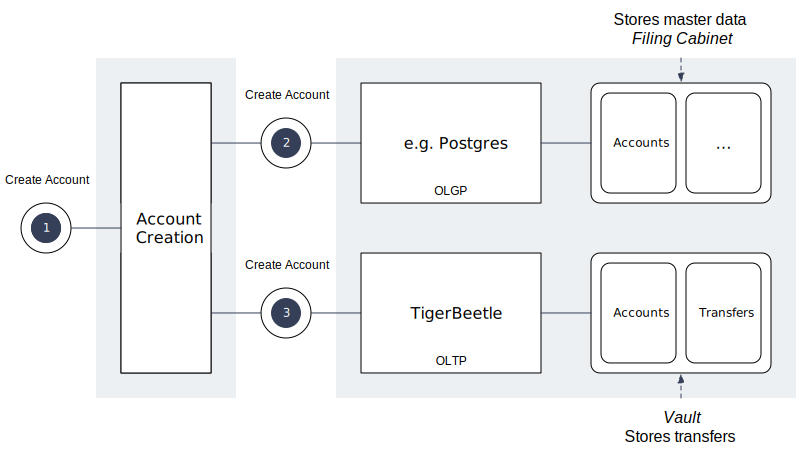

# Consistency Cabaret

An example demonstrating how to maintain consistency in the absence of transactions, using the Write Last, Read First principle featuring [TigerBeetle](https://tigerbeetle.com)

The example will implement the API with Resonate’s durable execution framework, Distributed Async Await. Distributed Async Await guarantees eventual completion simplifying reaching consistency even in the absence of transactions.

**Read the post on the [TigerBeetle Blog](https://tigerbeetle.com/blog/)**

## Overview



In the absence of transactions, we need to make an explicit architectural decision: Which system determines the existence of an account?

### System of Record vs System of Reference

- **System of Record (TigerBeetle)**: The champion. If the account exists here, the account exists on a system level.
- **System of Reference** : The supporter. If the account exists here but not in the system of record, the account does not exist on a system level.

### Order of Operations

Write last, read first

**When Writing**:
Write to the system of record last.

**When Reading**:
Read from the system of record first.

Since the system of reference doesn’t determine existence, we can safely write to it first without committing anything. Only when we write to the system of record does the account spring into existence. Conversely, when reading to check existence, we must consult the system of record, because reading from the system of reference tells us nothing about whether the account actually exists.

## Running the Example

The example is a command line interface to consistently create an account in the system of reference (here sqlite) and the system of record.

### Prerequisites

Download the required binaries to the `bin/` directory:

1. **TigerBeetle**: Download from [https://docs.tigerbeetle.com/start](https://docs.tigerbeetle.com/start/#install)
2. **Resonate**: Download from [https://github.com/resonatehq/resonate/releases](https://github.com/resonatehq/resonate/releases)

### Installation

Install dependencies:

```bash
npm install
```

### Setup

Run the setup script to prepare the databases:

```bash
./scripts/setup.sh
```

The setup script will:
1. Clean up any existing databases
2. Create a new TigerBeetle data file at `bin/0_0.tigerbeetle`
3. Create a new SQLite database at `bin/accounts.db`

### Running TigerBeetle

In a separate terminal window, start TigerBeetle:

```bash
./bin/tigerbeetle start --addresses=3000 bin/0_0.tigerbeetle
```

### Running Resonate

In a separate terminal window, start Resonate:

```bash
./bin/resonate dev
```

### Running the Example

Create an account:

```bash
tsx create-account.ts <uuid>
```

Example:

```bash
tsx create-account.ts user-123
```

### Verifying

```bash
./scripts/check.sh
```
## Learn More

- [Consistency Cabaret, The "Write Last, Read First" Rule](https://tigerbeetle.com/blog/)
- [TigerBeetle Documentation](https://docs.tigerbeetle.com/)
- [Resonate Documentation](https://docs.resonatehq.io/)
